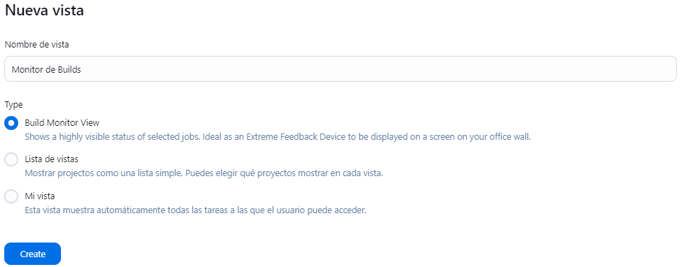
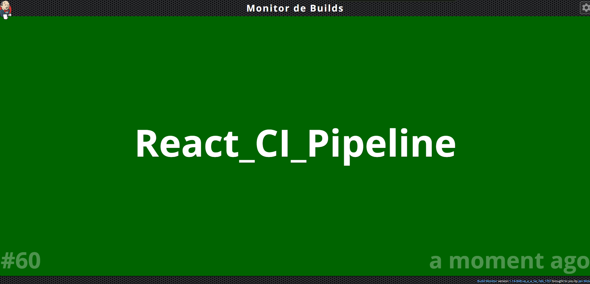
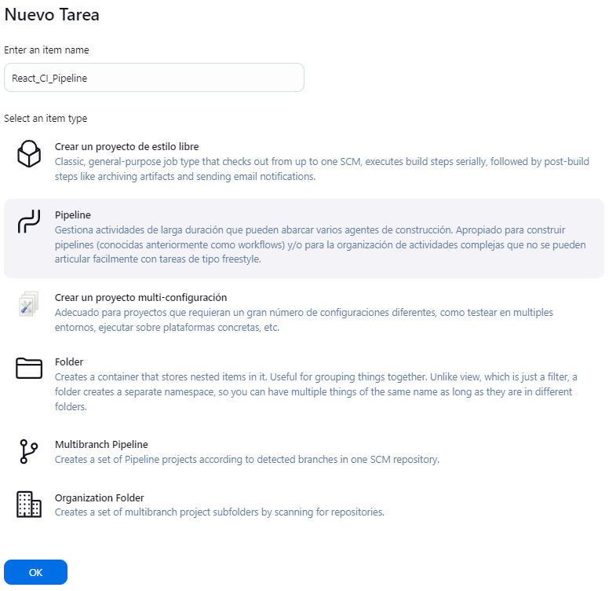
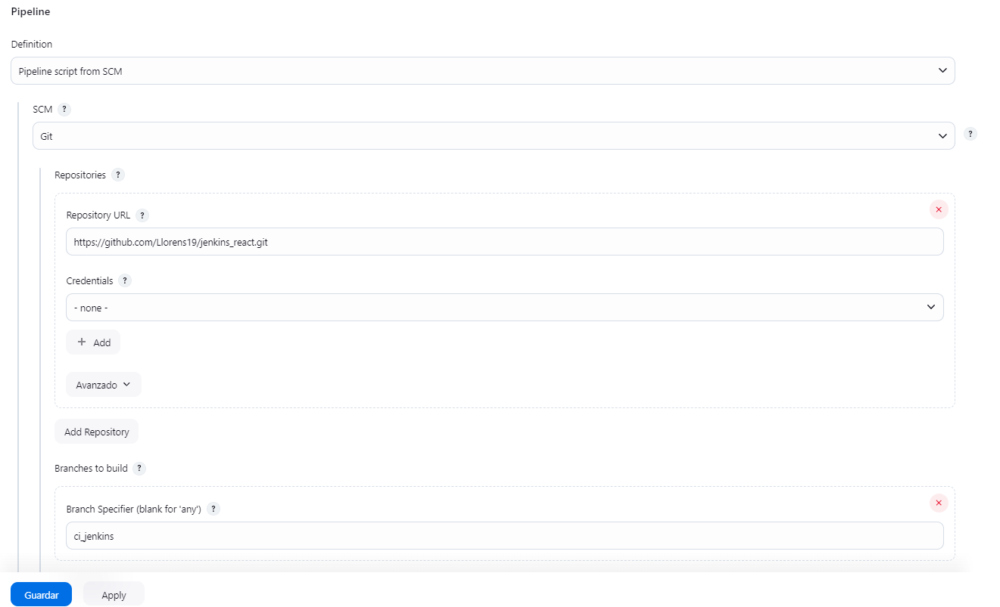
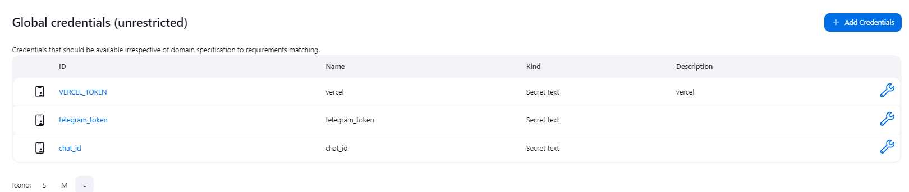
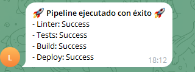

<!-- Utilizando un proyecto React cualquiera, deberéis crear una nueva rama (`ci_jenkins`) en la que existirá un `Jenkinsfile` para ejecutar un pipeline con las siguientes características:

**(0,3 puntos)** Instalar el plugin **Build Monitor View** ([link](https://plugins.jenkins.io/build-monitor-plugin/)) y configurar una vista en la que se muestren todas las tareas ejecutadas en Jenkins.

**(0,5 puntos)** Al ejecutarse, en una primera etapa (`Stage: Petición de datos`), pedirá tres valores por pantalla:
1. **Executor**: En el cual se especificará el nombre de la persona que ejecuta el pipeline.
2. **Motivo**: Donde podremos especificar el motivo por el cual estamos ejecutando el pipeline.
3. **Chat ID**: Almacenará el `Chat ID` de Telegram al cual notificaremos el resultado de cada etapa ejecutada.

**(1 punto)** `Stage: Linter`. Se encargará de ejecutar un linter sobre el proyecto React utilizando la librería del siguiente [enlace](https://eslint.org/) (si no está disponible, deberéis instalarla y configurarla). En caso de que existan errores, deberéis corregirlos hasta que el job se ejecute sin problemas.

**(1 punto)** `Stage: Test`. Vuestro proyecto deberá incluir al menos **3 tests implementados con Jest**, en los que verifiquéis la funcionalidad de tres métodos de vuestro código (métodos utilizados en la lógica de la aplicación).

**(0,3 puntos)** `Stage: Build`. Realizará el build del proyecto para generar una versión empaquetada del mismo que será la que se publique en Vercel.

**(1 punto)** `Stage: Update_Readme`. Ejecutará un script (que deberéis crear dentro de una carpeta `jenkinsScripts` en vuestro proyecto) encargado de modificar el archivo `README.md` del proyecto añadiendo uno de los siguientes badges al final del mismo y tras el texto `RESULTADO DE LOS ÚLTIMOS TESTS`:

- **(Failure)** [](https://shields.io/)
- **(Success)** [](https://shields.io/)

**(1 punto)** `Stage: Push_Changes`. Ejecutará un script (que también estará dentro de la carpeta `jenkinsScripts`) encargado de ejecutar los comandos `git add`, `git commit` y `git push` para los cambios en el README al repositorio de código. El comentario del commit deberá seguir el siguiente formato:  
`Pipeline ejecutada por PARAM_EXECUTOR. Motivo: PARAM_MOTIVO`.

**(1,5 puntos)** `Stage: Deploy to Vercel`. Ejecutará un script (que también estará dentro de la carpeta `jenkinsScripts`) encargado de publicar el proyecto en la plataforma Vercel ([link](https://vercel.com/)). Se ejecutará solo si las demás etapas se han completado satisfactoriamente.

**PISTA:** Podéis usar el CLI de Vercel ([link](https://vercel.com/docs/cli)) para ejecutar el despliegue fácilmente.

**(1 punto)** `Stage: Notificación`. Se encargará de enviar un mensaje al bot de Telegram con:
- **Destinatario**: `Chat ID` establecido como parámetro.
- **Mensaje**:
  ```
  Se ha ejecutado el pipeline de Jenkins con los siguientes resultados:
  - Linter_stage: resultado asociado
  - Test_stage: resultado asociado
  - Update_readme_stage: resultado asociado
  - Deploy_to_Vercel_stage: resultado asociado
  ```
El resultado asociado de cada etapa se almacenará utilizando variables de entorno. Cualquier variable cuyo valor pueda ser comprometedor o secreto deberá configurarse como una credencial de Jenkins.

---

Una vez realizadas todas las acciones anteriores, documentaréis correctamente todos los pasos realizados en el archivo `README.md` del proyecto. Por supuesto, deberá incluir:
1. Una introducción teórica sobre los conceptos tratados (principalmente Jenkins).
2. El proceso de configuración del pipeline a través de la UI de Jenkins.

**(1,5 puntos)** Como respuesta a la actividad planteada, deberéis entregar el link a vuestro repositorio en GitHub, así como el link de Vercel donde estará desplegado el proyecto. -->


<!-- pipeline {
    agent any
    parameters {
        string(name: 'EXECUTOR', defaultValue: 'Llorens19', description: 'Nombre de la persona que ejecuta el pipeline')
        string(name: 'MOTIVO', defaultValue: 'Test', description: 'Motivo para ejecutar el pipeline')
        string(name: 'CHAT_ID', defaultValue: '1142960583', description: 'Chat ID de Telegram para notificaciones')
    }
    stages {
        stage('Petición de datos') {
            steps {
                script {
                    echo "Executor: ${params.EXECUTOR}"
                    echo "Motivo: ${params.MOTIVO}"
                    echo "Chat ID: ${params.CHAT_ID}"
                }
            }
        }
        stage('Linter') {
            steps {
                script {
                    bat 'npx eslint src/ || exit 1'
                }
            }
        }
        stage('Test') {
            steps {
                script {
                    bat 'npm test -- --watchAll=false --passWithNoTests || exit 1'
                }
            }
        }
        stage('Build') {
            steps {
                script {
                    bat 'npm run build || exit 1'
                }
            }
        }
        stage('Push_Changes') {
            steps {
                script {
                    // Ejecuta el script para hacer commit y push
                    bat 'set EXECUTOR=%EXECUTOR% && set MOTIVO=%MOTIVO% && node jenkinsScripts/pushChanges.js || exit 1'
                }
            }
        }
        stage('Deploy to Vercel') {
        steps {
            withCredentials([string(credentialsId: 'VERCEL_TOKEN', variable: 'VERCEL_TOKEN')]) {
                script {
                    bat 'vercel --token %VERCEL_TOKEN% --prod --yes || exit 1'
                }
            }
        }
    }
        stage('Install Dependencies') {
            steps {
                script {
                    bat 'npm install'
                }
            }
        }

        stage('Notificación') {
            steps {
                withCredentials([
                    string(credentialsId: 'telegram_token', variable: 'TELEGRAM_TOKEN'),
                    string(credentialsId: 'chat_id', variable: 'CHAT_ID')
                ]) {
                    script {
                        bat 'set LINTER_RESULT=Success && set TEST_RESULT=Success && set BUILD_RESULT=Success && set DEPLOY_RESULT=Success && node jenkinsScripts/sendTelegramMessage.js || exit 1'
                    }
                }
            }
        }
    }
} -->


# Práctica Jenkins
---
## Descripción	
En esta práctica se ha configurado un pipeline en Jenkins para un proyecto React. El pipeline consta de las siguientes etapas:
1. **Petición de datos**: Se solicitan tres valores por pantalla: el nombre del ejecutor, el motivo por el que se ejecuta el pipeline y el Chat ID de Telegram al que se notificará el resultado de cada etapa.
2. **Linter**: Se ejecuta un linter sobre el proyecto React utilizando la librería ESLint.
3. **Test**: Se ejecutan 3 tests implementados con Jest.
4. **Build**: Se realiza el build del proyecto para generar una versión empaquetada del mismo que será la que se publique en Vercel.
5. **Update_Readme**: Se modifica el archivo `README.md` del proyecto añadiendo un badge al final del mismo.
6. **Push_Changes**: Se ejecutan los comandos `git add`, `git commit` y `git push` para los cambios en el README al repositorio de código.
7. **Deploy to Vercel**: Se publica el proyecto en la plataforma Vercel.
8. **Notificación**: Se envía un mensaje al bot de Telegram con los resultados de cada etapa.

## Configuración del pipeline
Para configurar el pipeline se ha creado un archivo `Jenkinsfile` en la rama `ci_jenkins` del proyecto. En este archivo se han definido las etapas del pipeline y las acciones a realizar en cada una de ellas.

### 1. Instalación del plugin Build Monitor View
Para instalar el plugin **Build Monitor View** se ha accedido a la sección de administración de Jenkins y se ha seleccionado la opción `Manage Plugins`. En la pestaña `Available` se ha buscado el plugin y se ha instalado. 

Una vez instalado, se ha configurado una vista con el tipo Build Monitor View en la que se muestran todas las tareas ejecutadas en Jenkins.



Vista final de la tarea:



## Creación del pipeline

El siguiente paso es crear una tarea de tipo pipeline en Jenkins. Para ello, se ha accedido a la sección de tareas y se ha seleccionado la opción `Nueva tarea`. Se ha introducido un nombre para la tarea y se ha seleccionado el tipo `Pipeline`.



En la sección de configuración de la tarea, se ha seleccionado la opción `Pipeline script from SCM` y se ha introducido la URL del repositorio de GitHub y la rama `ci_jenkins`.



## Configuración del proyecto

El primer paso ha sido desplegar un proyecto de React, en mi caso con Vite.

Seguidamente hemos creado un documento `Jenkinsfile` en la rama `ci_jenkins` y la hemos subido al remoto.

## Trabajos

### 1. Petición de datos
En esta etapa se solicitan tres valores por pantalla: el nombre del ejecutor, el motivo por el que se ejecuta el pipeline y el Chat ID de Telegram al que se notificará el resultado de cada etapa.

```groovy

    stage('Petición de datos') {
        steps {
            script {
                echo "Executor: ${params.EXECUTOR}"
                echo "Motivo: ${params.MOTIVO}"
                echo "Chat ID: ${params.CHAT_ID}"
            }
        }
    }
```

### 2. Linter
En esta etapa se ejecuta un linter sobre el proyecto React utilizando la librería ESLint.

```groovy
    stage('Linter') {
        steps {
            script {
                bat 'npx eslint src/ || exit 1'
            }
        }
    }
```

### 3. Test
En esta etapa se ejecutan 3 tests implementados con Jest que se han añadido a la carpeta src, 
el test se hace sobre el archivo utils.js.

```groovy
    stage('Test') {
        steps {
            script {
                bat 'npm test || exit 1'
            }
        }
    }
```

### 4. Build
En esta etapa se realiza el build del proyecto para generar una versión empaquetada del mismo que será la que se publique en Vercel.

```groovy
    stage('Build') {
        steps {
            script {
                bat 'npm run build || exit 1'
            }
        }
    }
```

### 5. Update_Readme
En esta etapa se modifica el archivo `README.md` del proyecto añadiendo un badge al final del mismo. Para hello se ha creado una carpeta llamada jenkinsScripts en la raíz del proyecto y se ha añadido un script llamado updateReadme.js.


```groovy
    stage('Push_Changes') {
            steps {
                script {
                    // Ejecuta el script para hacer commit y push
                    bat 'set EXECUTOR=%EXECUTOR% && set MOTIVO=%MOTIVO% && node jenkinsScripts/pushChanges.js || exit 1'
                }
            }
        }
```

### 6. Deploy to Vercel
En esta etapa se publica el proyecto en la plataforma Vercel. Para ello era necesrio hacer previamente el build anterior y ademas 
habia que configurar en las credenciales de Jenkins la variable de entorno VERCEL_TOKEN con el token de Vercel.

```groovy
    stage('Deploy to Vercel') {
        steps {
            withCredentials([string(credentialsId: 'VERCEL TOKEN', variable: 'VERCEL_TOKEN')]) {
                script {
                    bat 'vercel --token %VERCEL_TOKEN% --prod --yes || exit 1'
                }
            }
        }
    }
```



#### Url de Vercel

[https://react-ci-pipeline-abpsi3p8w-diegos-projects-9ecbf589.vercel.app/](https://react-ci-pipeline-abpsi3p8w-diegos-projects-9ecbf589.vercel.app/)

### 7. Notificación
En esta etapa se envía un mensaje al bot de Telegram con los resultados de cada etapa. Para ello, al igual que en el paso anterior, se han configurado las credenciales de Jenkins con el token de Telegram y el Chat ID.

```groovy
    stage('Notificación') {
        steps {
            withCredentials([
                string(credentialsId: 'telegram_token', variable: 'TELEGRAM_TOKEN'),
                string(credentialsId: 'chat_id', variable: 'CHAT_ID')
            ]) {
                script {
                    bat 'set LINTER_RESULT=Success && set TEST_RESULT=Success && set BUILD_RESULT=Success && set DEPLOY_RESULT=Success && node jenkinsScripts/sendTelegramMessage.js || exit 1'
                }
            }
        }
    }
```




## Resultado ultimo test

[](https://shields.io/)